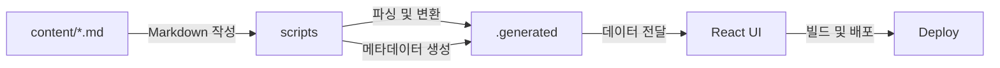

# 📝 My Blog

Markdown 기반으로 글을 작성하고,  
빌드 시 콘텐츠를 가공하여 화면에 보여주는 개인 블로그입니다.

단순한 블로그가 아니라,  
**GitHub 레포지토리 자체가 하나의 블로그 엔진이 되도록 설계하는 것**을 목표로 합니다.

<br />

## 📌 목적

단순한 블로그를 만드는 것을 넘어,  
콘텐츠 구조를 직접 설계하고 구현하는 것을 목표로 합니다.

- 공부한 내용을 꾸준히 기록하기 위한 공간
- Markdown 기반 글 작성 및 관리 경험 축적
- GitHub 레포지토리를 콘텐츠 관리 시스템(CMS)처럼 활용
- Git을 통한 글의 변경 이력 관리 및 버전 관리 경험
- 블로그의 내부 동작 흐름을 직접 구현하며 구조 이해

<br />

## 📁 폴더 구조

```md
📦 my-blog
├─ 📂 content/        → ✍️ Markdown 글 원본 저장소
│  ├─ 📂 web/         → 웹 전반 관련 글
│  ├─ 📂 javascript/  → JavaScript 관련 글
│  ├─ 📂 typescript/  → TypeScript 관련 글
│  ├─ 📂 react/       → React 관련 글
│  └─ 📂 nextjs/      → Next.js 관련 글
│
├─ 📂 scripts/        → ⚙️ 콘텐츠 가공 스크립트 (Markdown → 데이터)
├─ 📂 .generated/     → 🧾 가공된 결과물 저장 (JSON, 이미지 등)
├─ 📂 public/         → 🖼️ 정적 파일 (이미지, 아이콘 등)
├─ 📂 src/            → 💻 실제 UI 및 렌더링 코드
│
└─ 📄 README.md       → 프로젝트 설명
```

<br />

## 🔄 동작 흐름



### Markdown 기반 글 작성

  - `content/` 폴더에 `.md` 파일로 글을 작성
  - Markdown 파일 자체가 곧 게시글 데이터

### 콘텐츠 가공 (Build 단계)

  - Markdown 변환

    - Markdown을 HTML로 변환하여 화면 렌더링에 사용
    - Markdown을 JSON으로 변환하여 데이터 구조로 관리

  - 메타데이터 생성

    - description (본문 요약 자동 생성)
    - slug / id 생성

### 데이터 생성

  - 가공된 결과를 `.generated/`에 저장
  - 이후 UI에서 바로 사용할 수 있는 상태로 준비

### UI 렌더링

  - React가 `.generated/` 데이터를 읽어서 화면 구성
  - 글 목록 / 상세 페이지 생성

### 배포

  - 정적 페이지로 빌드 후 Vercel에 배포
  - GitHub push 시 자동 배포 (CI/CD)

<br />

## 📌 Commit Convention

커밋 메시지는 아래 규칙을 따릅니다.

### 타입 종류

- `feat` : 새로운 기능 추가
- `fix` : 버그, 문서 수정
- `chore` : 설정, 패키지 설치, 초기 세팅
- `refactor` : 기능 변화 없는 코드 개선
- `post` : 게시물 페이지 추가
- `style` : 코드 스타일 변경

### 예시

```
feat: 게시물 목록 페이지 구현
fix: README 내용 수정
chore: 프로젝트 초기 설정
post: 리액트 시작하기 게시물 등록
```