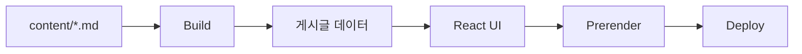

# 📝 junn.dev - Markdown 기반 개인 블로그


<br />

## ✨ 프로젝트 소개

Markdown 기반으로 글을 작성하고, 빌드 시 이를 가공하여 화면에 렌더링하는 개인 기술 블로그입니다.

단순히 글을 작성하는 공간을 넘어서, GitHub 레포지토리를 콘텐츠 관리 시스템(CMS)처럼 활용하여  
Markdown 파일을 중심으로 콘텐츠를 관리하고, 변경 이력을 Git으로 추적할 수 있도록 설계했습니다.

또한 frontmatter를 활용해 메타데이터를 구조화하고,  
카테고리 분류 및 slug 기반 라우팅을 직접 구현하여 콘텐츠 중심의 블로그 구조를 설계했습니다.

SEO를 고려한 메타데이터 처리와 접근성 개선까지 적용하여,  
단순 기록용이 아닌 실제 서비스 수준의 블로그를 만드는 것을 목표로 개발했습니다.

이 프로젝트를 통해 Markdown 기반 콘텐츠 관리 방식,  
데이터 가공 및 렌더링 흐름, 그리고 React 환경에서의 SEO 처리 경험을 쌓고자 했습니다.

<br />

🔗 **배포 링크** : [https://junn.dev](https://junn.dev)

<br />

## 🛠️ 기술 스택

### Core

|구분|사용 기술|
|---|---|
|Framework||
|Language||
|Styling||
|Build Tool||

### Library

|구분|사용 기술|
|---|---|
|Routing||
|Markdown Rendering||
|Syntax Highlight||
|Markdown Highlight||

### Deployment

|구분|사용 기술|
|---|---|
|Hosting||
|Domain||

<br />

## 🔄 동작 흐름



### Markdown 작성

  - `content/` 폴더에 `.md` 파일로 게시글 작성
  - Markdown 자체가 콘텐츠 데이터 역할
    - 제목 (title)
    - 설명 (description)
    - 날짜 (date)
    - 카테고리 (category)
    - slug (URL 경로)
    - 썸네일 (thumbnail)

### Build 단계

  - Markdown → 게시글 데이터로 변환

    - Markdown 파일을 읽어 본문(content)과 메타 정보(frontmatter)를 분리

  - 페이지별 메타데이터 자동 생성 (SEO, OG 등)

    - `<title>`
    - `<meta name="*">`
    - Open Graph
    - Twitter 카드
    - 게시글 상세 페이지는 frontmatter를 기반으로 메타데이터 생성

### UI 렌더링

  - React가 데이터를 기반으로 게시글 목록, 게시글 상세 페이지 구성

### Prerender

  - 모든 페이지를 정적 HTML로 미리 생성

    - 각 URL에 대해 HTML 생성
    - 페이지별 메타데이터를 `<head>`에 삽입
    - 완성된 HTML 파일을 생성

  - 브라우저가 JS 실행 전에 완성된 HTML을 바로 받음
  
    - SEO 및 성능 최적화

### Deploy

  - 정적 사이트로 배포 (Vercel)
  - Markdown 추가 시 자동으로 게시글 반영

<br />

## ⚠️ 트러블슈팅

<details>
  <summary>메타데이터가 HTML에 반영되지 않는 문제</summary>
  
  #### 문제 상황

  페이지별 메타데이터를 적용하기 위해 처음에는 react-helmet-async를 사용해 클라이언트에서 `<head>`를 관리했다. 라우트에 따라 `<title>`과 `<meta>`를 동적으로 변경하는 방식이었다.

  개발자 도구에서는 메타 태그가 정상적으로 적용된 것처럼 보였지만, Ctrl + U로 확인한 원본 HTML에는 반영되지 않는 문제가 발생했다.

  #### 원인

  react-helmet-async는 브라우저에서 React가 렌더링된 이후에 `<head>`를 수정하는 방식이다.
  즉, 메타데이터가 초기 HTML이 아니라 렌더 이후에 추가되는 구조였다.

  개발자 도구는 JavaScript 실행 이후의 DOM을 보여주지만,
  Ctrl + U는 서버가 처음 내려준 HTML을 보여주었다.

  이 차이로 인해 초기 HTML에는 메타데이터가 없고, SEO / SNS 공유 시 메타 정보가 제대로 전달되지 않는 상태가 되었다.

  #### 해결

  메타데이터를 클라이언트에서 처리하는 방식을 버리고,
  프리렌더 단계에서 HTML 생성 시 메타데이터를 포함하도록 구조를 변경했다.

  - `metadata.ts`에서 URL 기준 메타데이터 생성
  - `entry-server.tsx`에서 HTML 생성 시 `<head>`에 삽입

  #### 결과

  초기 HTML에 메타데이터가 포함되면서 Ctrl + U에서도 정상적으로 확인할 수 있게 되었고, SEO 및 SNS 공유 미리보기까지 안정적으로 동작하게 되었다.

  또한 페이지별 메타데이터를 클라이언트가 아닌 HTML 기준으로 일관되게 관리할 수 있게 되었다.
</details>

<details>
  <summary>gray-matter 사용 시 Buffer 에러</summary>

  #### 문제 상황

  Markdown frontmatter를 파싱하기 위해 `gray-matter`를 사용했지만, 브라우저에서 실행 시 `Buffer is not defined` 에러가 발생했다.

  #### 원인

  `gray-matter`는 Node.js 환경을 기준으로 만들어진 라이브러리로, 내부적으로 `Buffer`를 사용한다. 하지만 현재 프로젝트는 브라우저에서 markdown을 직접 처리하는 구조이기 때문에 Node 전역 객체를 사용할 수 없어 에러가 발생했다.

  #### 해결

  Node 환경에서 미리 파싱하는 방식 대신, 브라우저에서 직접 frontmatter를 파싱하는 로직을 구현했다. 문자열 기반으로 `---`를 기준으로 분리하고 key-value 형태로 처리하는 방식으로 구현했다.

  #### 결과

  브라우저에서도 정상적으로 동작하게 되었고, 외부 라이브러리 의존성을 제거할 수 있었다. 또한 Markdown 데이터 구조를 직접 다루면서 이해도를 높일 수 있었다.
</details>


<br />

## 📁 폴더 구조

```md
my-blog
├─ content/                               # 마크다운 원본 글을 카테고리별로 관리하는 폴더
│  ├─ ai/
│  ├─ javascript/
│  ├─ nextjs/
│  ├─ react/
│  ├─ typescript/
│  └─ web/
│
├─ public/                                # 정적 파일을 그대로 제공하는 폴더
│  └─ thumbnails/                         # 게시글 썸네일 이미지를 모아두는 폴더
│
├─ scripts/                               # 빌드 후처리/정적 페이지 생성 스크립트 폴더
│  └─ prerender.mjs                       # prerender 대상 라우트를 HTML로 생성하는 스크립트
│
└─ src/                                   # 실제 앱 코드가 들어있는 폴더
   ├─ app/                                # 라우터 설정을 모아두는 폴더
   │  ├─ router.tsx                       # 브라우저 라우터를 생성하는 파일
   │  └─ routes.tsx                       # 페이지 라우트 목록을 정의하는 파일
   │
   ├─ components/                         # 재사용 UI 컴포넌트를 모아두는 폴더
   │  ├─ layout/                          # 레이아웃 UI 컴포넌트 폴더
   │  │  ├─ Footer.tsx                    # 사이트 하단 푸터 컴포넌트
   │  │  ├─ Header.tsx                    # 사이트 상단 헤더 컴포넌트
   │  │  └─ Navigation.tsx                # 헤더 내 내비게이션 컴포넌트
   │  └─ notes/                           # 노트 목록/필터 UI 컴포넌트 폴더
   │     ├─ NoteCard.tsx                  # 게시글 카드 1개를 렌더링하는 컴포넌트
   │     ├─ NoteFilter.tsx                # 카테고리 필터 버튼 목록 컴포넌트
   │     └─ NoteList.tsx                  # 게시글 목록을 렌더링하는 컴포넌트
   │
   ├─ layouts/                            # 페이지 공통 레이아웃 폴더
   │  └─ RootLayout.tsx                   # Header, Outlet, Footer를 묶는 루트 레이아웃
   │
   ├─ lib/                                # 데이터 가공/헬퍼 로직 폴더
   │  ├─ metadata.ts                      # URL 기준 메타데이터를 계산하는 파일
   │  └─ notes.ts                         # Markdown을 파싱해 노트 데이터로 변환하는 파일
   │
   ├─ pages/                              # 라우트에 연결되는 페이지 컴포넌트 폴더
   │  ├─ HomePage.tsx                     # 홈 화면 페이지
   │  ├─ NotFoundPage.tsx                 # 앱 내부 404 페이지
   │  ├─ NoteDetailPage.tsx               # 게시글 상세 페이지
   │  └─ NotesPage.tsx                    # 게시글 목록 페이지
   │
   ├─ styles/                             # 전역 및 페이지별 스타일 폴더
   │  ├─ home.css                         # 홈 화면 스타일
   │  ├─ index.css                        # 전역 스타일 진입 파일
   │  ├─ layout.css                       # 레이아웃 관련 스타일
   │  ├─ notes.css                        # 노트 목록/상세 관련 스타일
   │  └─ reset.css                        # 기본 브라우저 스타일 초기화 파일
   │
   ├─ types/                              # 공통 타입 정의 폴더
   │  └─ note.ts                          # 노트/카테고리 관련 타입 정의 파일
   │
   ├─ entry-client.tsx                    # 클라이언트 hydration 진입 파일
   └─ entry-server.tsx                    # 서버 렌더링 및 prerender용 진입 파일
```

<br />

## 📌 Commit Convention

커밋 메시지는 아래 규칙을 따릅니다.

### 타입 종류

- `feat` : 새로운 기능 추가
- `fix` : 버그, 문서 수정
- `chore` : 설정, 패키지 설치, 초기 세팅
- `refactor` : 기능 변화 없는 코드 개선
- `post` : 게시물 페이지 추가
- `style` : 코드 스타일 변경

### 예시

```
feat: 게시물 목록 페이지 구현
fix: README 내용 수정
chore: 프로젝트 초기 설정
post: 리액트 시작하기 게시물 등록
```